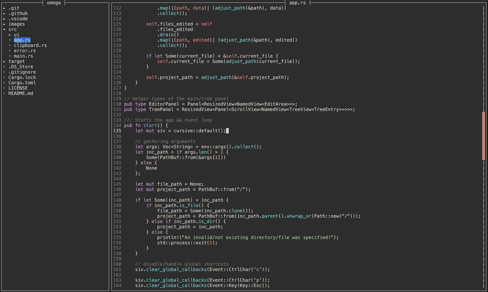

# omega

A performant and extensive terminal-based file editor with a wide variety of modern shortcuts.



## How to use

```bash
omega [path]
```
That will open a file and the editor itself.

`path` can only be a file, not a directory.

When specifying a not existing/invalid path the editor displays that in the top right via a `*` after the path (if no path is specified only the `*` will be visible).

> Moving the cursor via mouse input is also possible.

## Bindings
| Global          | Keybinding   |
| --------------- | ------------ |
| Infos           | `Ctrl` + `z` |
| Toggle debugger | `Ctrl` + `d` |
| Quitting        | `Ctrl` + `q` |
| Force Quitting  | `Ctrl` + `f` |
| Saving File     | `Ctrl` + `s` |

| Editor             | Keybinding                                    |
| ------------------ | --------------------------------------------- |
| Copying Line       | `Ctrl` + `c`                                  |
| Paste Clipboard    | `Ctrl` + `v`                                  |
| Cut Line           | `Ctrl` + `x`                                  |
| Move Line          | `Shift` + <kbd>&uarr;</kbd>/<kbd>&darr;</kbd> |
| Move Cursor to EoL | `Shift` + <kbd>&larr;</kbd>/<kbd>&rarr;</kbd> |
| Ident              | `Tab`                                         |
| Remove Ident       | `Shift` + `Tab`                               |

## Installation

You can currently install the editor using cargo:
```bash
cargo install omega
```
